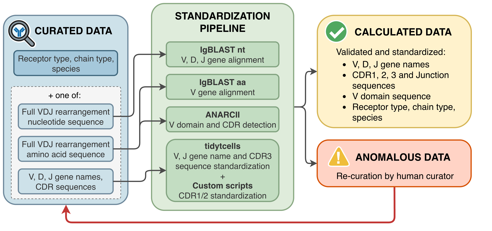

# IEDB receptor pipeline

This repository contains the IEDB receptor data standardization and validation pipeline. 
It accommodates the bioRxiv preprint for: [Revised Adaptive Immune Receptor Data in the Immune Epitope Database](https://doi.org/10.64898/2026.06.03.728549). 

The IEDB hosts manually curated epitope and cognate immune receptor data. 
- **Standardization:** The *curated* data is passed through this computational pipeline to produce the standardized *calculated* data. 
Depending on the format of the curated data (full nucleotide/amino acid sequences, or V/D/J gene names and CDR subsequences only), 
a different set of computational tools is used to standardize this data. 
- **Validation:** Extensive tests are performed to ensure the output data is coherent, and to identify mismatches between e.g., 
receptor and chain types, species and gene names, or gene names and CDR3 sequences.

## Pipeline steps

The processing pipeline has the following steps:

1. The pipeline can be run using various entrypoints:
    - [run_on_export.py](run_on_export.py) runs on the full IEDB TCR/BCR export files
    - [run_on_curation_template.py](run_on_curation_template.py) runs on the IEDB Curation Template for new data
    - [run_on_db.py](run_on_db.py) runs on direct database exports

2. All entrypoints use sanity checks in [parse_input.py](parse_input.py) for input validation. 

3. Next, [run_tools.py](run_tools/run_tools.py) will execute [run_anarcii.py](run_tools/run_anarcii.py), [run_igblast.py](run_tools/run_igblast.py) and [run_tidytcells.py](run_tools/run_tidytcells.py) to produce calculated data outputs. 

4. Finally, [consolidate_results.py](consolidate_results.py) combines the data from the different tools, and performs the final sanity checks. 

5. The output folder will contain:
   - Any primary output files, which will depend on the pipeline entrypoint: 
     - The *IEDB TCR/BCR export files* with overwritten calculated data, 
     - the *Curation Template* with calculated data filled in, 
     - or a direct overwrite of the internal database table. 
   - `log.txt` - A log file containing all validation warnings and errors. 
   - `intermediate_results/` - Any results from the [run_tools.py](run_tools/run_tools.py) script, which will be the same for all entrypoints. 
     - `consolidate_results.csv` - the combined results from all tools, with tool sources
     - `tool_input.csv`
     - `anarcii_results.csv`
     - `igblast_aa_results.csv`
     - `igblast_nt_results.csv`
     - `tt_results.csv`
   - `tmp/` - folder with temporary files (raw IgBLAST output)